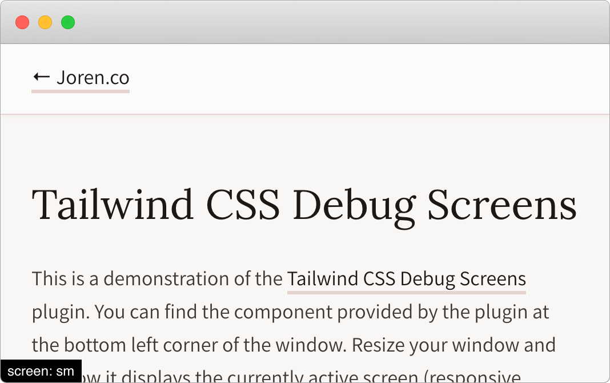

# Tailwind CSS Debug Screens 📱

A Tailwind CSS component that shows the currently active screen (responsive breakpoint).

[Demo](https://joren.co/tailwindcss-debug-screens-demo/)



## Install

Requires **Tailwind v1.0** or higher.

1. Install the plugin:

```bash
npm install tailwindcss-debug-screens --save-dev
```

2. Add it to your `tailwind.config.js` file:

```js
// tailwind.config.js
module.exports = {
  //...
  plugins: [
    require('tailwindcss-debug-screens'),
  ]
}
```

## Usage

Add the class `debug-screens` to your `<body>` tag.

```html
<body class="debug-screens">
```

Make sure the class is only present during development. Here's an example of how you could do that in Craft CMS:

```twig
<body class="{{ devMode ? 'debug-screens' : '' }}">
```

### Customization

You can customize this plugin in the `theme.debugScreens` section of your `tailwind.config.js` file.

#### Ignore screens

To ignore a specific screen (for instance [dark mode](https://tailwindcss.com/docs/dark-mode)), add the screen name to the `ignore` configuration array. `dark` is ignored by default.

```js
// tailwind.config.js
module.exports = {
  theme: {
    debugScreens: {
      ignore: ['dark'],
    },
  },
  plugins: [
    require('tailwindcss-debug-screens'),
  ],
}
```

#### Position

The first item of the position configuration array can be `top` or `bottom`, the second item can be `left` or `right`.

```js
// tailwind.config.js
module.exports = {
  theme: {
    debugScreens: {
      position: ['bottom', 'left'],
    },
  },
  plugins: [
    require('tailwindcss-debug-screens'),
  ],
}
```

#### Styles

Take a look at the [index.js](index.js) file to see all the default styles.

```js
// tailwind.config.js
module.exports = {
  theme: {
    debugScreens: {
      style: {
        backgroundColor: '#C0FFEE',
        color: 'black',
        // ...
      },
    },
  },
  plugins: [
    require('tailwindcss-debug-screens'),
  ],
}
```

#### Prefix

Modify the debug label prefix with the `prefix` configuration option.

```js
// tailwind.config.js
module.exports = {
  theme: {
    debugScreens: {
      prefix: 'screen: ',
    },
  },
  plugins: [
    require('tailwindcss-debug-screens'),
  ],
}
```

#### Selector

Modify the debug element selector with the `selector` configuration option.

```js
// tailwind.config.js
module.exports = {
  theme: {
    debugScreens: {
      selector: '.debug-screens',
    },
  },
  plugins: [
    require('tailwindcss-debug-screens'),
  ],
}
```
